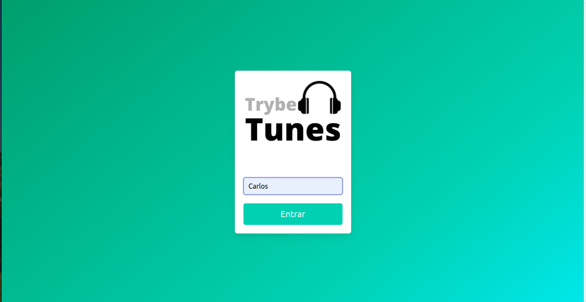
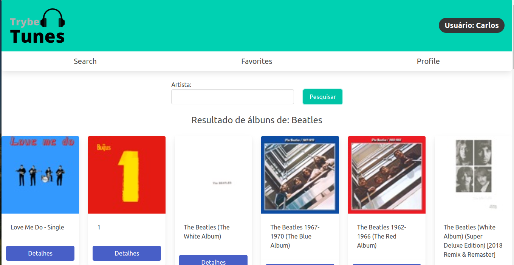
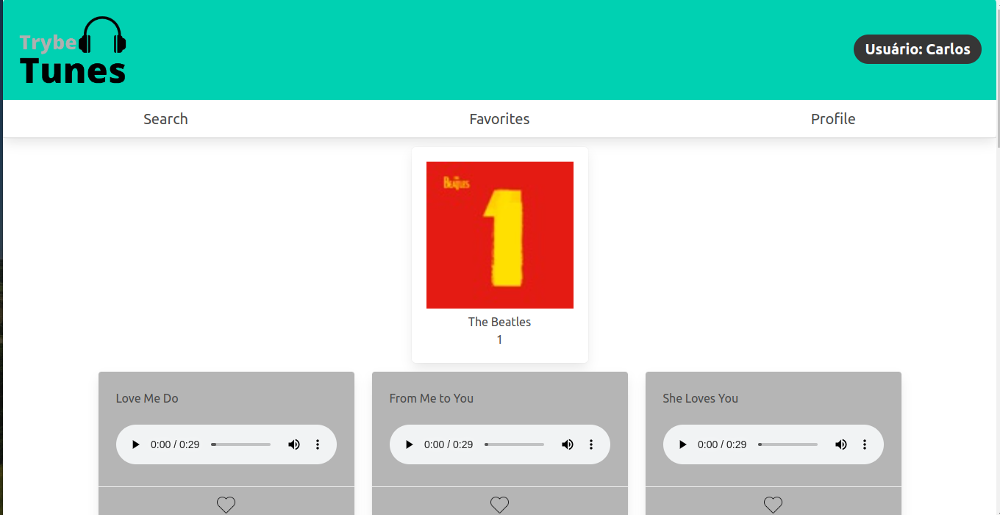
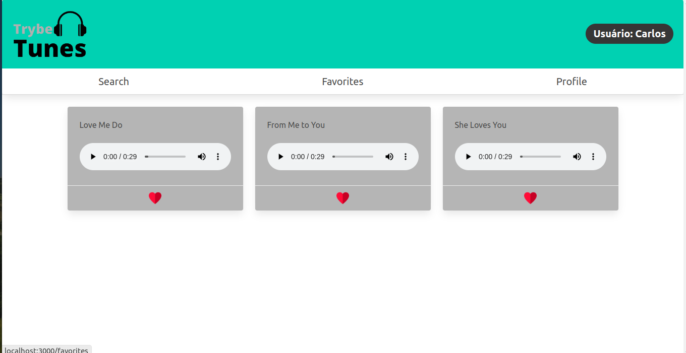

# Projeto TrybeTunes

Aqui você encontrará os detalhes sobre o projeto: como instalar, executar, funcionalidades, recursos e tecnologias utilizadas.

## Introdução

O **TrybeTunes** é uma aplicação que consome dados da API do [iTunes](https://developer.apple.com/library/archive/documentation/AudioVideo/Conceptual/iTuneSearchAPI/index.html#//apple_ref/doc/uid/TP40017632-CH3-SW1), faz busca por artista, toca e favorita músicas.

## Instalação/Execução
### Como instalar
 
Clonar o respositório  
`git clone git@github.com:stonefullstm/project-trybetunes.git`  
 
Entrar no repositório  
`cd project-trybetunes`  
 
Instalar as dependências 
`npm install` 
 
### Como executar  

`npm start` 

## Funcionalidades

1. Informar o nome do usuário para logar na aplicação
   
2. Na tela de pesquisa (Search) digite o nome de um artista para buscar os álbuns correspondentes
   
3. Escolha um álbum para ver a lista de músicas e clique no botão **Detalhes**
   
4. Clique no player para ouvir um pequeno trecho ou no coração para favoritar/desfavoritar a música
5. Na tela de favoritas (Favorites) pode-se visualizar todas as músicas favoritas, ouvir trechos ou desfavoritar
   
## Tecnologias utilizadas

